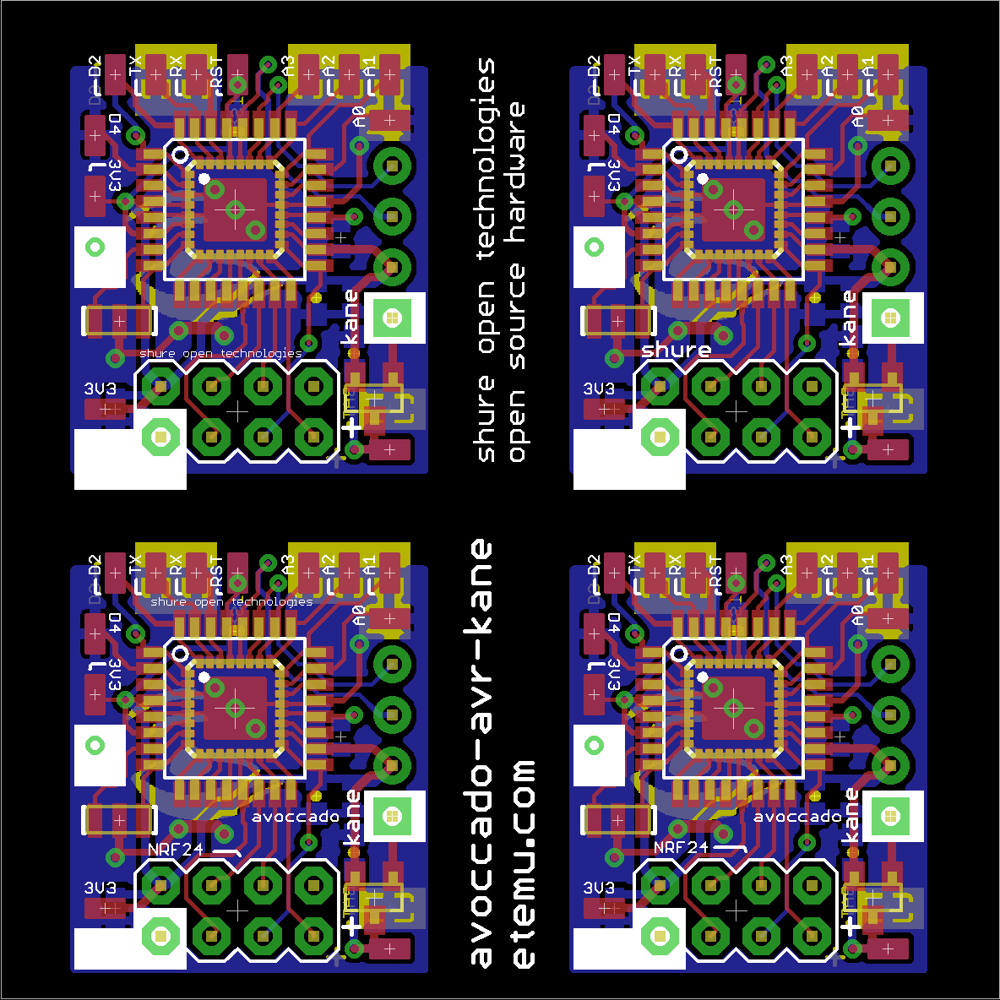
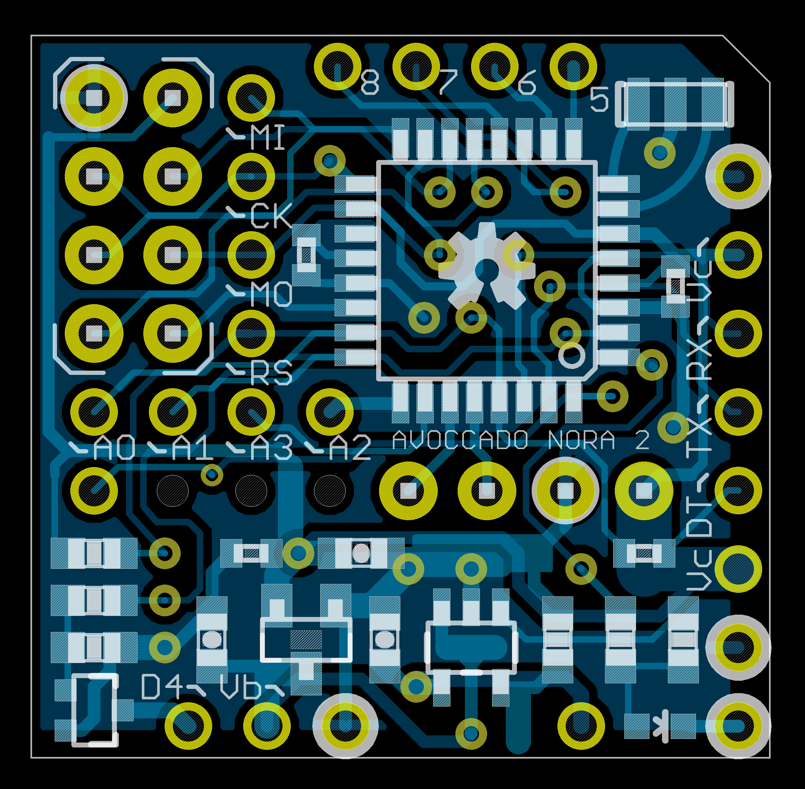
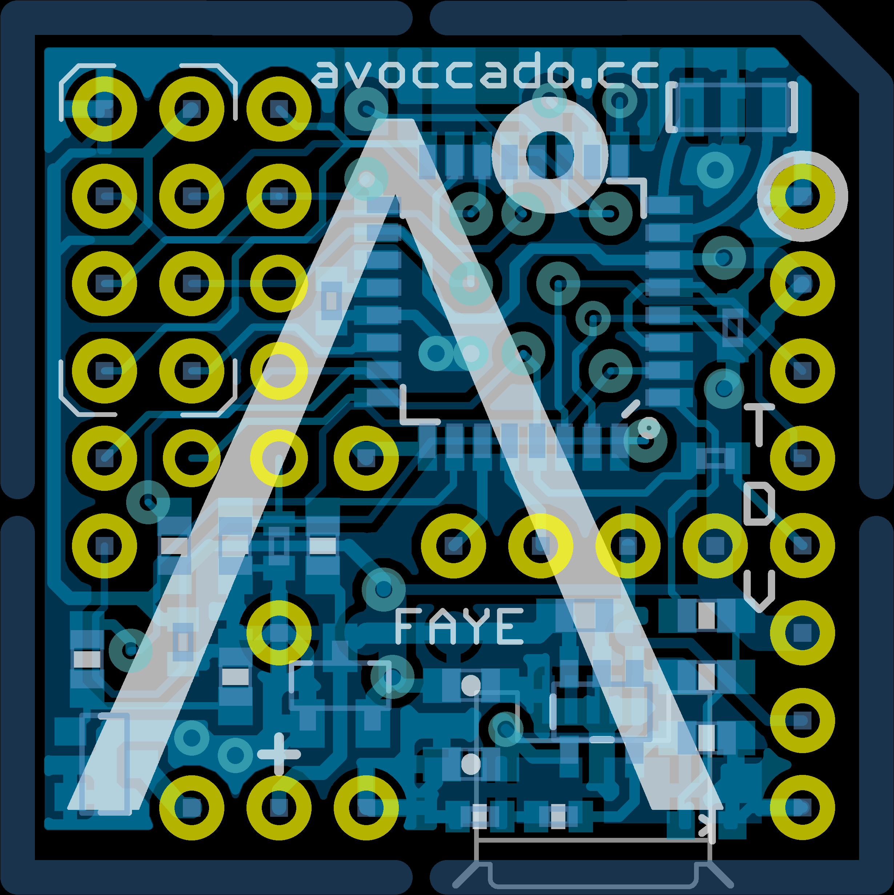
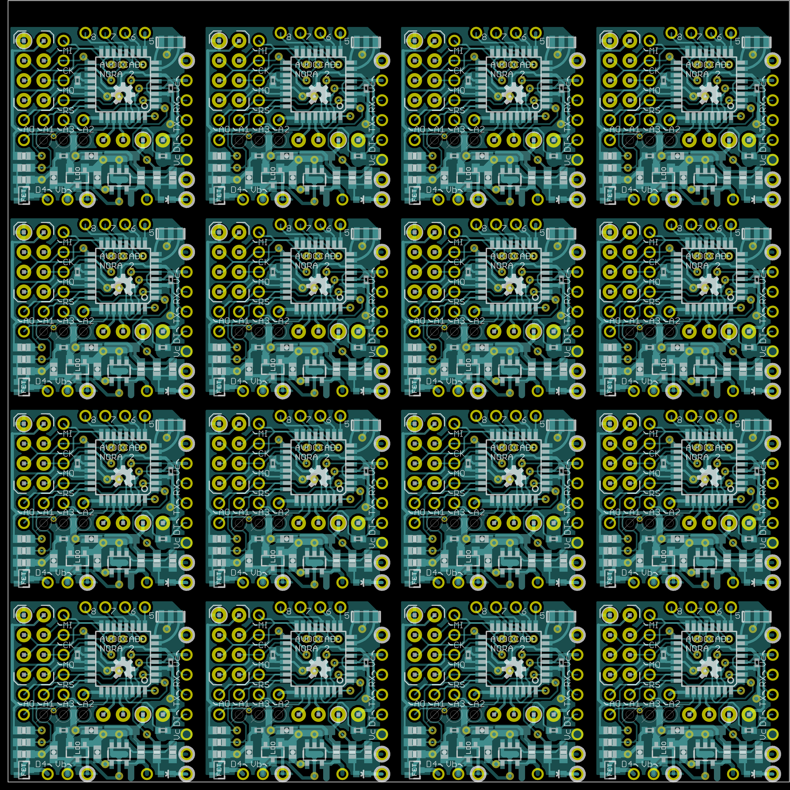

Avoccado° PCB layouts and schematics
================

**Most recent version: Avoccado° Felina**

This repository contains the source files of the PCBs for Avoccado° controllers equipped with AVR micro controllers.

There are different PCBs, some with more than one revision. Check the commit log for the most recent development version.

 - Alpha 1 (A1): 8/10 mil width/spacing, 2 sided, components on one side, full size rectangular board a la Arduino Nano / Pro Mini with female micro USB 2.0 and LiPo charger
 - Kane: 8/8 mil, small square board without LiPo charger, components on both sides, good as a tiny RX (receiver) node.
 - Yolandi: 8/8 mil, never tested
 - Nora 1: square board, about one square inch, IRQ from NRF24 routed to MCU
 - Nora 2: same as Nora 1 with IRQ from NRF24 and MPU6050 routed to MCU
 - Faye: updated Nora 2 with voltage divider to sense battery voltage and derive SOC (state of charge), added optional micro USB SMD socket on bottom layer, optionally less part diversity count as R_charge-program can be set with two serialised 1K 0402 resistors. Faye has got an equal 100 mil grid for every pin header and test point.
 - Felina: Features like Faye, without 0402 R_charge-program, non-square footprint, with MPU6050 QFN on board (optional), USB SMD on bottom layer
 - Gin: Board layout smaller than one NRF24L01 PCB module, features AtMega328 QFN + MPU6050 QFN. Not possible to hand solder, very small overall footprint. USB connector only passive (for charging)

Alpha 1 (A1):
----------------

USB bootloader option to update the firmware if the 68R resistors are populated. The USB data lines connect to D2 and D7.
There is a 2K pullup to 3.3V at the D- USB data line, no zener diodes to limit the voltage at the data lines because the MCU runs at USB compliant 3.3V VCC, see vUSB recommendations here: http://vusb.wikidot.com/hardware

Kane
----------------

Smallest version when MPU6050 board not used. Hard to populate due to parts on both sides. Good for tiny receiver nodes, can be hidden in the E27 socket of a light bulb, wall socket..

Nora
----------------

Notes and ideas: No cinsistent 100 mil grid with all headers at the moment
Plated half holes are nice for SMD piggybacking the hole board. Mind the test points and exposed pads on the bottom.

Faye
----------------

Consistent 100 mil grid for all pin headers, additional test points (all conforming the 100 mil grid).
Tighter spacing with 0402 parts now close to the MCU and border of the board.
Battery voltage fed into ADC portpin through high impedance voltage divider to estimate SOC with the MCU.
Optional micro USB socket on the bottom. Data lines not used as of now due to routing constraints, only used for power and charging LiPo batteries.

Felina
----------------

InvenSense MPU6000 / MPU6050 QFN package on board instead of peripheral daughter board. Header for peripheral board still available. Slim rectangular design, slightly longer due to additional parts for onboard MPU, thus only 10 PCBs per panel instead of the usual 16.
Battery voltage fed into ADC portpin through high impedance voltage divider to estimate SOC with the MCU.
Optional: Micro USB female on bottom side for charging
Optional: V-USB components with 2K pullup on D- to enable USB firmware usage. (needs airwire for one data line) 
Attention: V-USB uses same D2 IRQ line as MPU6050.
Consistent 100 mil grid for all pin headers, additional test points, SMD pad for vibration motor output.

Gin
----------------

InvenSense MPU6050 QFN package, Atmel AtMega328p QFN package, very small overall footprint, smaller than a NRF24 module. No seperate ICSP header, flashing only via test points and the NRF24 connector. No DTR reset latch with capacitor.
Consistent 100 mil grid for all headers and test points. 

Panels 
----------------

Boards are either panelized to 50 x 50 mm² or 100 x 100 mm² because my test jig can hold those two sizes. PCBs are usually placed on a 25 mm grid - that is slightly below one inch (25.4 mm).

Test jigs
----------------
Nora 2 test jig is compatible with Nora 1 and Nora 2
See separate repository for test jig assemblies
